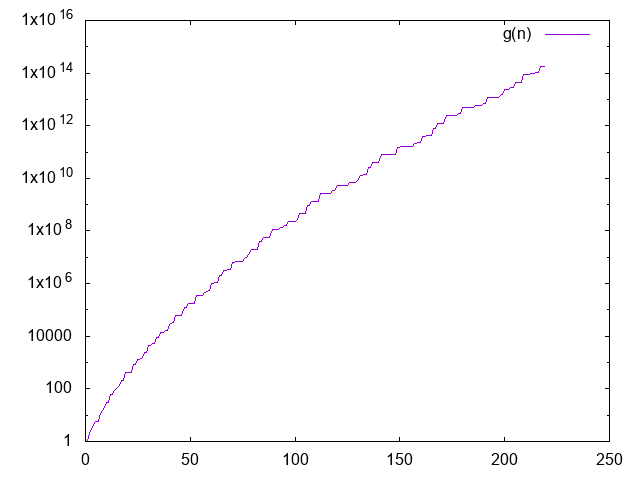

# landau

Calculates [Landau's function](http://mathworld.wolfram.com/LandausFunction.html), g(n): the
greatest LCM of an integer partition of n. This is equal to the highest order of an element of the
symmetric group S(n).

